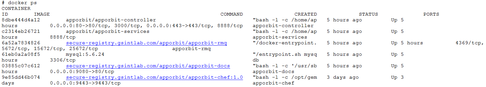
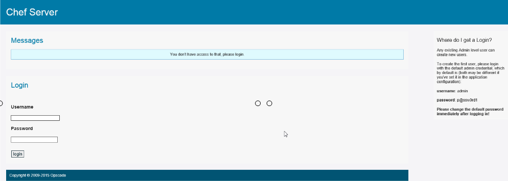
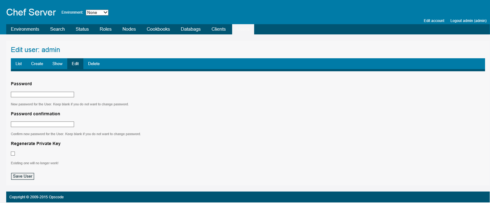

**Deploying the appOrbit Platform**
===================================

The appOrbit Platform is installed and deployed using the following
procedures:

-   Prerequisite requirements

-   Install the appOrbit Platform.

-   Verify the deployment using docker ps

-   Change the appOrbit Chef default password.

Each of these procedures is described in a separate topic.

### **Prerequisite requirements**

Before you install and deploy the appOrbit Platform, complete these
prerequisite steps:

1.  Enter your License key (or Trial license provided on installation
    > for 60 days).

2.  Verify that you have your appOrbit Platform credentials on hand.
    > These credentials are provided by your appOrbit
    > Sales/Business representative. For example,
    > admin/&lt;*password*&gt;

Contact your Sales or Business representative if you have questions
about your appOrbit Platform License key (or Trial license) or user
credentials, or when you require assistance.

### **To install the appOrbit Platform**

1.  Verify that the firewall and cloud settings make ports 80, 443, 9443
    > and 8080 accessible from the internet. In addition, verify that
    > [*http://repos.gsintlab.com*](http://repos.gsintlab.com) is
    > accessible and not blocked by the network firewall settings.

2.  Run the following command to begin the installation:

> **\# bash &lt;(curl
> "http://repos.gsintlab.com/install/apporbit-curl.sh")**
>
> After the installation begins, the following prompt displays:
>
> Installing appOrbit Platform containers requires selinux to be set to
> permissive mode.
>
> Do you want to continue (Y or N)?

1.  Type one of the following responses:

-   **Y** (Yes, the default) to set selinux to permissive mode and
    > continue with the installation.

-   **N** (No) to cancel the installation.

> A prompt for logon information for the Docker Registry displays.

1.  Type your credentials (provided by your appOrbit Sales or
    > Business representative) to logon to the Docker Registry. The
    > logon credentials include the Username, Password and
    > Email address.

> Once you enter the logon information, the following prompt displays:
>
> WARNING: login credentials saved in /root/.docker/config.json
>
> Logon Succeeded
>
> The following prompt displays:
>
> Enter the deployment scenario:
>
> Type Y (default) to install appOrbit Chef in the same machine as the
> appOrbit Platform.
>
> Type N to deploy appOrbit Chef to an external host.

1.  Type one the following responses:

> For more information, go to “appOrbit Deployment Scenarios”.

-   **Y** (Yes, the default), when you want to deploy appOrbit Chef an
    > All in Private Network or All in Public Network deployment.

-   **N** (No), when you are using a Mixed Mode Deployment and want to
    > deploy appOrbit Chef to an external host in the public network.

> The following prompt displays:
>
> Enter the appOrbit Chef installation type:
>
> Type Y (default) to install appOrbit Chef.
>
> Type N when appOrbit Chef is already deployed on a different machine.

1.  Type one of the following responses:

-   **Y** (Yes, the default) when you want to install appOrbit Chef on
    > the same machine as the appOrbit Platform.

-   **N** (No) when appOrbit Chef is already deployed on a
    > different machine.

> A confirmation message displays:
>
> Do you want to continue to deploy appOrbit Chef (Y or N)?

1.  Type one of the following responses:

-   **Y** (Yes, the default) to install appOrbit Chef from
    > Docker Registry.

-   **N** (No) to cancel the installation.

> The following prompt displays:
>
> Enter the IP address for the appOrbit Platform:
>
> Type the Host IP (default is 52.11.51.251)
>
> Type the IP that is used to access appOrbit Chef.

1.  Type one of the following responses:

-   Public IP address for the machine (the default is 52.11.51.251).

-   Public IP address that is used to access appOrbit Chef.

> When you install the appOrbit Platform, the following prompt displays:
>
> Enter the deployment type:
>
> Type 1 (default) to deploy from the Registry
>
> Type 2 to deploy from the Tar file

1.  For the **Deployment Type**, type one of the following responses:

-   **1** (the default) to deploy the appOrbit Platform from the
    > Docker Registry.

-   **2** to deploy the appOrbit Platform from a Tar file, when the
    > internet cannot be accessed.

> The next prompt is shown:
>
> Enter the Build ID (default is Latest):

1.  For the **Build ID**, type one of the following responses:

-   **Latest** (the default)

-   A specific version of the product

> The following prompt displays:
>
> Do you want to clean up the setup (removes Database, RabbitMQ Data and
> so on)?
>
> Type 1 (default) to clean the setup
>
> Type 2 to retain the older entries

1.  Type one of the following responses:

-   **1** (the default) when you are installing the appOrbit Platform
    > for the first time. This removes any older instances of the
    > appOrbit Platform.

-   **2** to upgrade the setup and retain any older instances of the
    > appOrbit Platform.

> The next prompt displays:
>
> Mode of Operation:
>
> Type 1 (the default) for ON PREM MODE
>
> Type 2 for SAAS MODE

1.  For **Mode of Operation**, type one of the following responses:

-   **1** (ON PREM MODE, the default) when a single tenant is used.

-   **2** (SaaS MODE) when a SaaS-based or multi-tenant setup is used.

> The next prompt is shown:
>
> Enter the Host IP (the default is 52.11.51.251):

1.  For the **Host IP**, type one of the following responses:

-   **52.11.51.251** (the default)

-   IP address of the host

1.  When the installation is complete, the Welcome to appOrbit
    > page displays.

> To logon to the appOrbit Platform using the web interface, go to
> “Logging On”.

### **To verify the deployment using docker ps **

You can use docker ps to verify that the appOrbit Platform and all of
the containers in the machine are running properly.

To use docker ps, type the following command at the Linux command
prompt:

> **\# docker ps **

The output from this command is illustrated below.

**IMPORTANT**: When an error is encountered, and the appOrbit Platform
installation script is not completed correctly, you are required to
reinstall the appOrbit Platform, or contact appOrbit Support for
assistance.

### **To change the appOrbit Chef default password **

1.  Verify that the appOrbit Platform is running properly.

> For more information, go to “To verify the deployment using docker
> ps”.

1.  Type [*https://IPADDRESS:9443*](https://ipaddress:9443) on the
    > appOrbit Chef Management user interface to change your
    > default password.

1.  On the Home page, type your credentials (provided by your appOrbit
    > Sales or Business representative):

-   **User Name**: appOrbit admin name (admin@gemini-systems.net).

-   **Password**: Default password (admin1234).

> Contact your Sales or Business representative if you have questions
> about your appOrbit Platform credentials or when you require
> assistance.

4.  Click **login**.

4.  On the Edit user: admin page (Edit tab), type a new, secure
    > **Password** and type a **Password confirmation** for your
    > appOrbit admin account. Change the default password of the
    > appOrbit Chef Server from admin/p@ssw0rd1 to the new password.

> **IMPORTANT**: Do not click the Regenerate Private Key checkbox. Leave
> this field blank.
>
> Do not change appOrbit Platform certificates when you change the
> password. Otherwise, the appOrbit Chef settings will need to be
> updated, and the appOrbit Controller cannot communicate with the
> appOrbit Chef Server.

4.  Click **Save User**.

5.  When complete, at the top, click **Logout admin** to exit appOrbit
    > Chef Management user interface.

> A confirmation displays.

4.  Click **OK**.

> The Home page of the appOrbit Chef Management user interface displays.

4.  Close the user interface.
