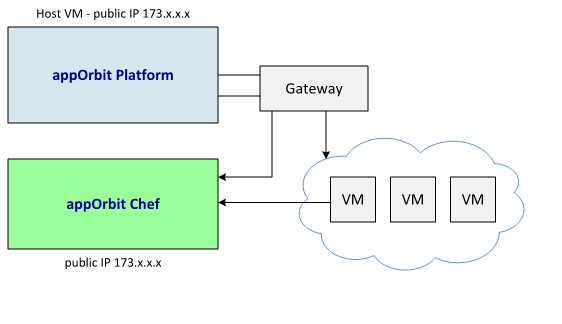
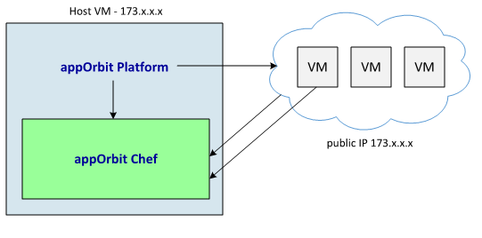
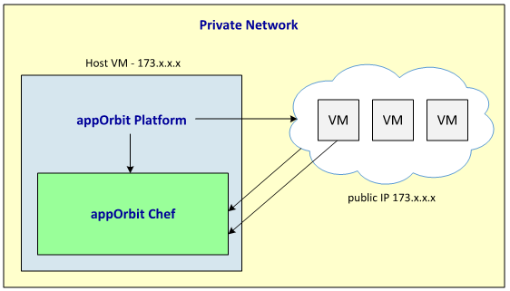
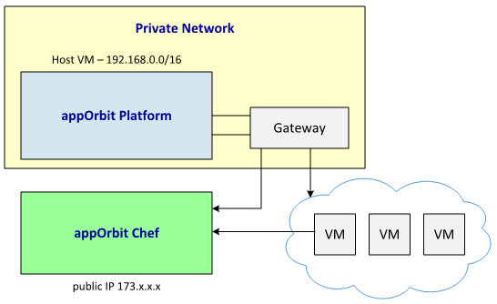

**appOrbit Deployment Scenarios**
=================================

The appOrbit Platform uses these common deployment scenarios:

-   All in public network

-   All in private network

-   Mixed mode deployment

**Note**: The All in Public and All in Private deployment scenarios both
use the same installation procedure.

Each of the deployment scenarios are described below.

All in Public Network 
--------------------------

For the All in Public Network scenario (the default), all of the virtual
machines you create are deployed in the public network. In addition, you
can either deploy a separate, hosted appOrbit Chef, or deploy the
appOrbit Chef in the same host machine as the appOrbit Platform.

**Figure x. All in Public
Network - hosted appOrbit Chef**

**Figure x. All in Public
Network - appOrbit Chef in the appOrbit Platform host**

All in Private Network
--------------------------

For the All in Private Network scenario, all of the virtual machines you
create are deployed in the private network. In addition, you deploy the
appOrbit Chef in the same host machine as the appOrbit Platform.

**Figure x. All in Private Network**

Mixed Mode Deployment
-------------------------

For a Mixed Mode Deployment scenario, the appOrbit Platform is installed
in a private network. The appOrbit Chef is deployed on an external host
in the public network.

**Figure x. Mixed Mode Deployment**

